![Artboard][NuggetLogo]

# GoldenNugget

> [!WARNING]
> **Back up your device before applying tweaks.** GoldenNugget can cause data loss, boot loops, or other unexpected device problems. Use this project at your own risk; the authors are not responsible for damage to your device or data.

[](LICENSE)

Unlock your device's full potential, with iOS 27 support!

Customize your device with animated wallpapers, disable pesky daemons, and more!

Make sure you have installed the [requirements](#requirements) if you are on Windows or Linux.

## Quick Start

1. Install the device connection tools listed in [Requirements](#requirements).
2. Create and activate a virtual environment:

```bash
python -m venv .venv
# Windows PowerShell
.\.venv\Scripts\Activate.ps1
# macOS/Linux
source .venv/bin/activate
```

3. Install the pinned dependencies and start GoldenNugget:

```bash
python -m pip install -r requirements.txt
python main_app.py
```

Make a full device backup before applying tweaks. Use `python main_app.py --test-mode`
to open the interface with mock devices and no iPhone connected.

## Compatibility

| Component | Supported | Notes |
| --- | --- | --- |
| iOS | 26.2–27.x | Older versions are blocked by the app. |
| Windows | Apple Devices or iTunes | Install one before connecting an iPhone. |
| Linux | `usbmuxd` and `libimobiledevice` | Both are required for USB access. |
| Python | 3.10+ | Use the pinned packages in `requirements.txt`. |

## Discord server
Wanted support? Join our [Discord Server][server].

## On-device mobile version
We already developed a on-device GoldenNugget Mobile that do not need computer. [Here][mobile] it is.

## Features
<details>
<summary>iOS 26.2 - 27.0+</summary>

- PosterBoard: Animated wallpapers and descriptors.
  - Community wallpapers can be found [here][WallpapersWebsite] or [here][caplayground]
  - Customizing community-made wallpapers via batter files
  - Device-Specific wallpapers in MercuryPoster can be installed
  - See documentation on the structure of tendies and batter files in [documentation.md](documentation.md)
- Templates: Custom Operations and file editing
  - See documentation on the structure of batter files in [documentation.md](documentation.md)
- Status Bar
  - iOS 26 and below: full override set
    - Change carrier name
    - Change secondary carrier name
    - Enable/Disable the primary or secondary carriers
    - Change the number of WiFi/Cellular bars
    - Change the battery capacity
    - Change battery display detail
    - Change time text
    - Change date text (iPad only)
    - Change breadcrumb text
    - Show numeric WiFi/Cellular strength
    - Hide or show many icons in the status bar
  - iOS 27 and above: carrier name only (the rest of the overrides have no
    equivalent in the new status bar format and are hidden on that page)
    - Change carrier name
    - Change secondary carrier name
    - Not yet verified on physical hardware, only on the iOS 27 simulator
- Springboard Options
  - Set Lock Screen Footnote
  - Set Lock Screen Idle Auto-Lock Time
  - Disable Lock After Respring
  - Disable Screen Dimming While Charging
  - Disable Low Battery Alerts
  - Hide AC Power on Lock Screen
  - Show Supervision Text on Lock Screen
  - Show Dynamic Island in Screenshots
  - Enable AirPlay support for Stage Manager
  - Show Red/Green Authentication Line on Lock Screen (See [this issue](https://github.com/leminlimez/Nugget/issues/656) for what it looks like)
  - Disable Floating Tab Bar on iPads
- Internal Options
  - Build Version in Status Bar
  - Force Right to Left
  - Show Hidden Icons on Home Screen
  - Force Metal HUD Debug
  - iMessage Diagnostics
  - IDS Diagnostics
  - VC Diagnostics
  - App Store Debug Gesture
  - Notes App Debug Mode
  - Show Touches With Debug Info
  - Hide Respring Icon
  - Play Sound on Paste
  - Show Notifications for System Pastes
- Disable Liquid Glass (iOS 26.0+):
  - Ignore Liquid Glass App Build Check (iOS 26.0+)
  - Force Solarium Fallback (iOS 26.0+, doesn't work on iOS 27 anymore)
- Disable Daemons:
  - OTAd
  - UsageTrackingAgent
  - Game Center
  - Screen Time Agent
  - Logs, Dumps, and Crash Reports
  - ATWAKEUP
  - Tipsd
  - VPN
  - Chinese WLAN service
  - HealthKit
  - AirPrint
  - Assistive Touch
  - iCloud
  - Internet Tethering (aka Personal Hotspot)
  - PassBook
  - Spotlight
</details>

## Screenshots

<details>
<summary>Open the English interface screenshots</summary>

<table>
<tr>
<td>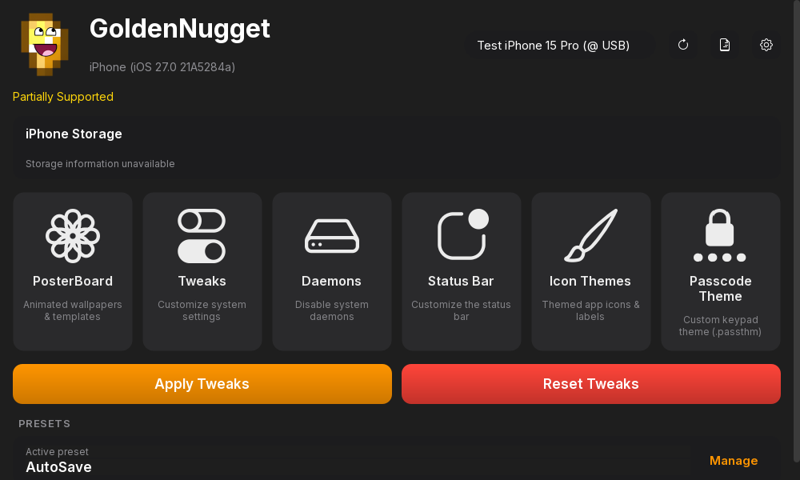</td>
<td>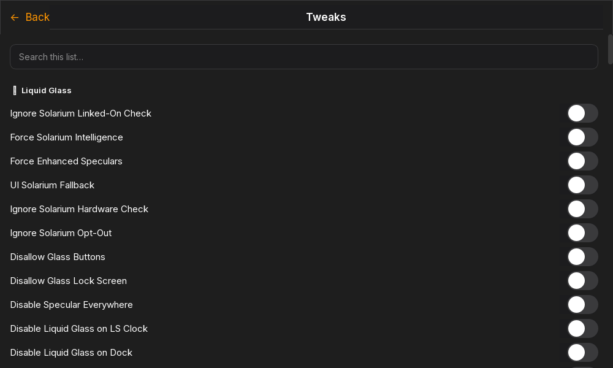</td>
<td>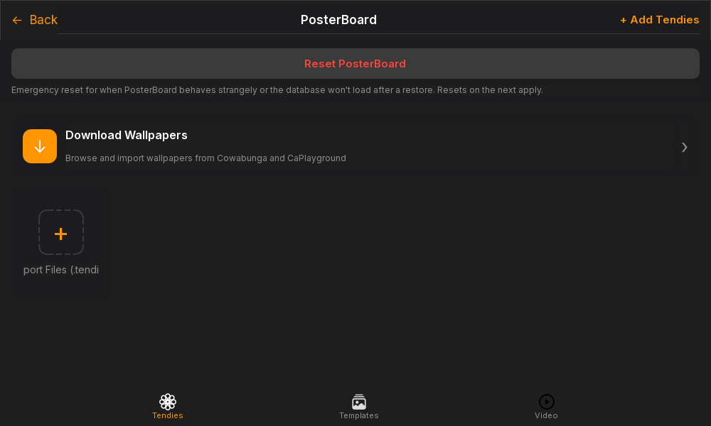</td>
</tr>
<tr>
<td>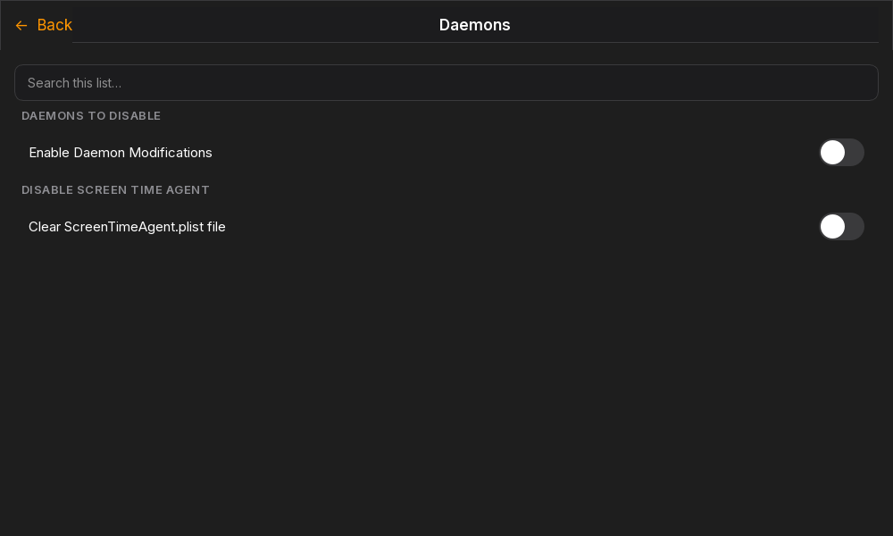</td>
<td>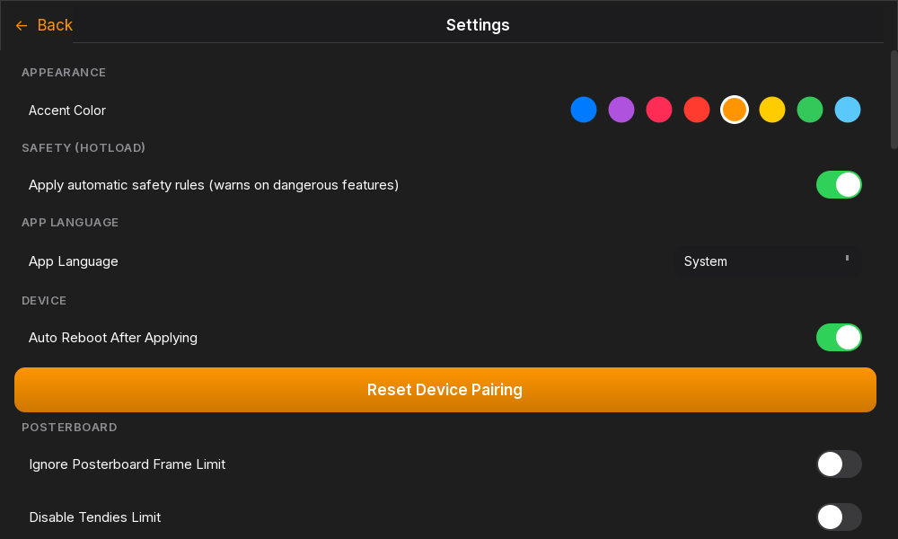</td>
<td>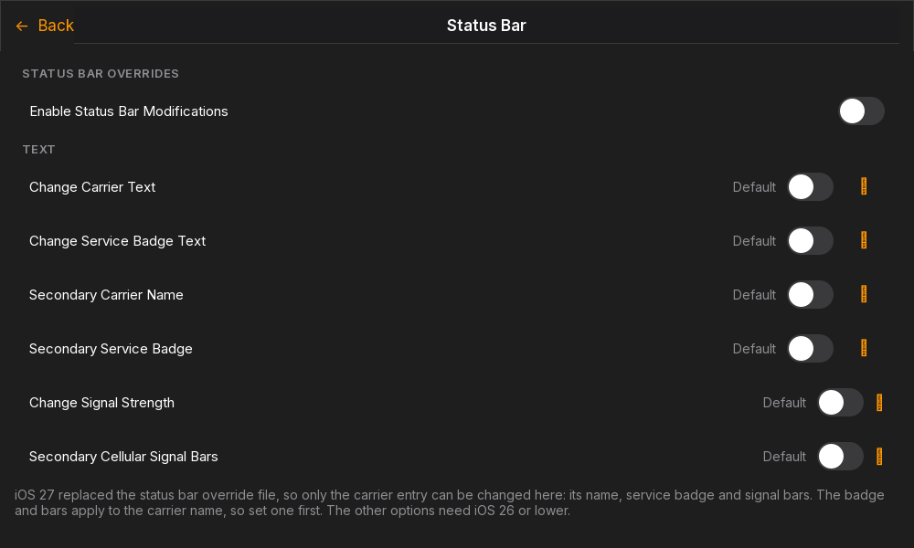</td>
</tr>
<tr>
<td>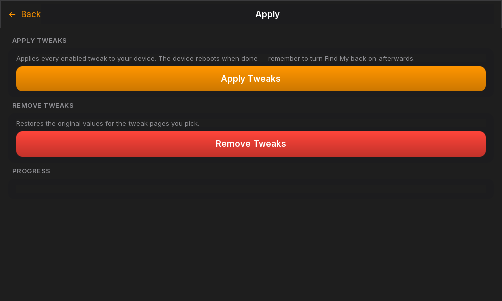</td>
<td>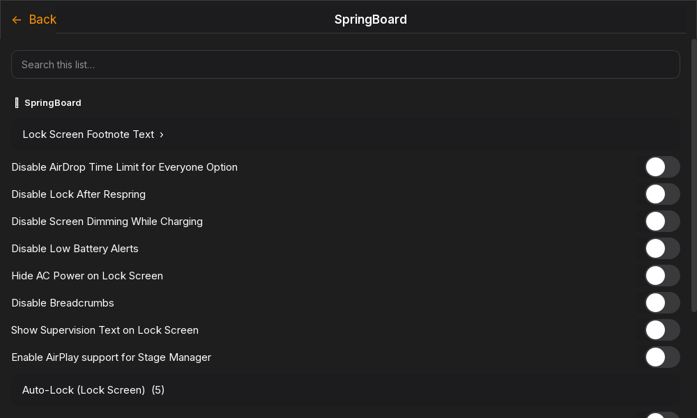</td>
<td>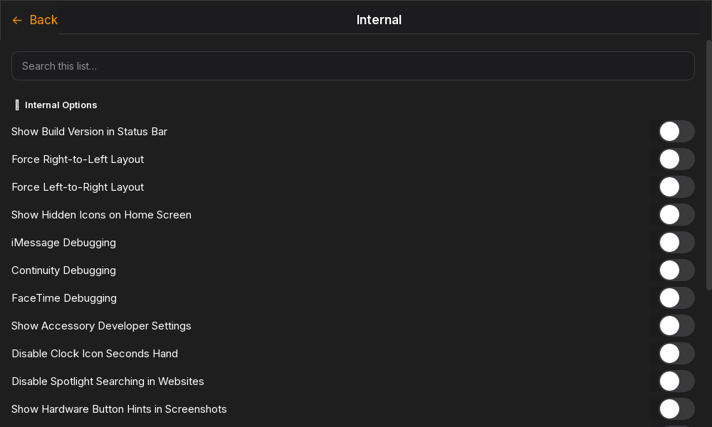</td>
</tr>
<tr>
<td>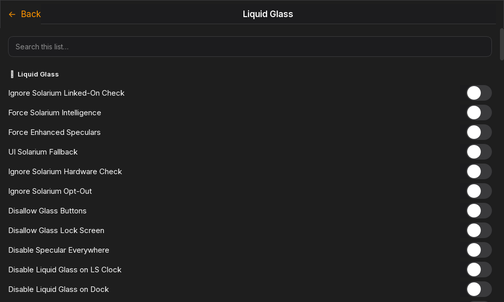</td>
<td>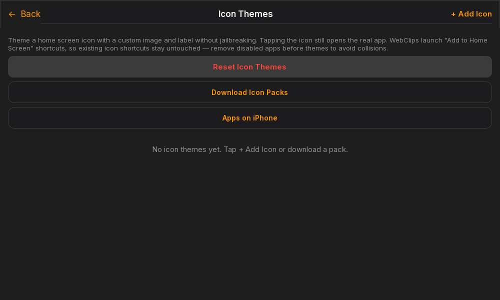</td>
<td>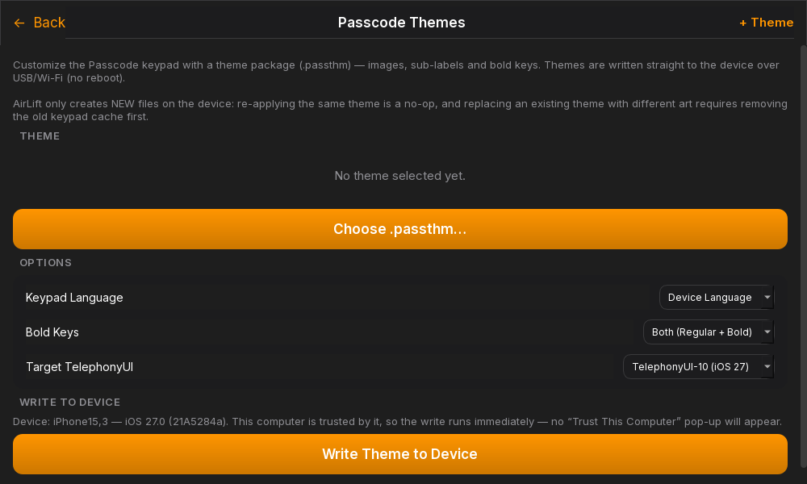</td>
</tr>
</table>

</details>

## Contributors 

<div align="center">

**Thanks everyone who contributes to project!** 🎉

<a href="https://github.com/awesomenull-dev/GoldenNugget/graphs/contributors">
  
</a>

Want to see your name here? Open [Pull Request](https://github.com/awesomenull-dev/GoldenNugget/pulls)!

</div>

## Star History

<a href="https://www.star-history.com/?type=date&repos=awesomenull-dev%2FGoldenNugget">
 <picture>
   <source media="(prefers-color-scheme: dark)" srcset="https://api.star-history.com/chart?repos=awesomenull-dev/GoldenNugget&type=date&theme=dark&legend=top-left&sealed_token=3Suw7Y0hFqwuBPijtmeM2A7pzK2ZCvEPoousYMJzOVFnPza-Aq5SzgNnEcgveIpQsBLEOL2QRtxwZbmaxn_S_3Lf9l0jINrMfRWkjFWGo3dVYCrFRpN6dA" />
   <source media="(prefers-color-scheme: light)" srcset="https://api.star-history.com/chart?repos=awesomenull-dev/GoldenNugget&type=date&legend=top-left&sealed_token=3Suw7Y0hFqwuBPijtmeM2A7pzK2ZCvEPoousYMJzOVFnPza-Aq5SzgNnEcgveIpQsBLEOL2QRtxwZbmaxn_S_3Lf9l0jINrMfRWkjFWGo3dVYCrFRpN6dA" />
   
 </picture>
</a>

<div align="center">
<br>We think you can star this repo if you think this is a good project.</br>
</div>

> [!NOTE]
> ## Mobilegestalt
> Don't even ask me for it. It will be NEVER implemented again. 

## Requirements:
<details>
<summary>Windows</summary>
  
  - Either the [Apple Devices (from Microsoft Store)][AppleDevices] App or [iTunes (from Apple website)][iTunes]
</details>

<details>
<summary>Linux</summary>

  - [usbmuxd][usbmuxdGitHub]
  - [libimobiledevice][libimobiledeviceGitHub]
</details>

<details>
<summary>For Running Python</summary>

  - [pymobiledevice3][pymobiledevice3GitHub]
  - [PySide6][PySide6Doc] (PySide6-Essentials on non-Linux, selected automatically)
  - [ffmpeg-python](https://pypi.org/project/ffmpeg-python/) (video wallpapers)
  - [opencv-python](https://pypi.org/project/opencv-python/) (video wallpapers)
  - Python 3.10 or newer
</details>

> All pinned deps are in `requirements.txt` (incl. PyInstaller for building).

## Running the Python Program
> [!NOTE]
> It is highly recommended to use a virtual environment:
> ```py
> python3 -m venv .env # only needed once
> ```
macOS/Linux:
```py
source .env/bin/activate
```
Windows:
```py
.env/Scripts/activate.bat
```
Install Packages:
```py
pip3 install -r requirements.txt # only needed once
python3 main_app.py
```
> [!NOTE]
> Depending on your system configuration, use either `python/pip` or `python3/pip3`.

## Building
To compile `mainwindow.ui` for Python, run the following command:
```py
pyside6-uic --from-imports src/qt/mainwindow.ui -o src/qt/mainwindow_ui.py
```

To compile the resources file for Python, run the following command:
```py
pyside6-rcc src/qt/resources.qrc -o src/qt/resources_rc.py
```

To create and compile languages, you can use the following commands:
```py
pyside6-lupdate main_app.py src/gui/main_window.py src/gui/pages/page.py src/gui/pages/pages_list.py src/gui/pages/main/*.py src/gui/pages/tools/*.py src/gui/dialogs/*.py src/gui/ios/*.py src/devicemanagement/device_manager.py src/exceptions/*.py src/tweaks/*.py src/tweaks/posterboard/*.py src/tweaks/posterboard/template_options/*.py src/tweaks/status_bar/*.py src/controllers/*.py -ts src/qt/translations/Nugget_{language code}.ts # generate/update the language file
pyside6-lrelease src/qt/translations/Nugget_{language code}.ts -qm src/qt/translations/Nugget_{language code}.qm # compile to binary
```

> **Note:** `src/qt/mainwindow.ui` is no longer in the list. The Classic UI
> source was deleted (see the "TEMP: Classic UI removed" note in
> [AGENTS.md](AGENTS.md)), so the pattern matched nothing. Its generated
> counterpart `src/qt/mainwindow_ui.py` cannot stand in either: `pyside6-uic`
> emits `u"..."` string literals and **lupdate silently skips `u`-prefixed
> literals** (verified: stripping the prefix recovers the sidebar strings,
> leaving it yields zero). The Classic-UI strings already in the catalogs are
> therefore unreachable by the pipeline and can only come back together with
> `mainwindow.ui`. Re-add the pattern when Classic returns.

The application itself can be compiled by running `compile.py`.

# Contributing and forking.
See [CONTRIBUTING.md](https://github.com/awesomenull-dev/GoldenNugget/blob/main/CONTRIBUTING.md), want fork instead? Then see [FORKING.md](https://github.com/awesomenull-dev/GoldenNugget/blob/main/FORKING.md)

## Credits
- [awesomenull] Lead developer
- [Wind0ws11Aero] for helping with development a lot.
- Translations crowdsourced using [gNugget-i18n repository][i18n]
- [LeminLimez] for creating Nugget.
- [0xjonhnnydev] for [AirLift]
- [LEGACY] Old translations was crowdsourced using [Nugget POEditor][POEditorJoin]. Thank you everyone who assisted in the translation effort!
- [PosterRestore][PosterRestoreDiscord] for their help with PosterBoard
  - Special thanks to [dootskyre][dootskyreX], [Middo][MiddoX], [dulark][dularkGitHub], forcequitOS, and pingubow for their work on nugget. It would not have been possible without them!
  - Thanks to [Snoolie for aar handling][python-aar-stuffGitHub]!
- [iTechExpert][iTechExpertTwitter] for various Springboard/Internal Options
- [Mikasa-san][Mikasa-sanGitHub] for [Quiet Daemon][QuietDaemonGitHub]
- [pymobiledevice3][pymobiledevice3GitHub] for restoring and device algorithms.
- [PySide6][PySide6Doc] for the GUI library.

[caplayground]: https://caplayground.vercel.app/wallpapers
[i18n]: https://github.com/awesomenull-dev/gNugget-i18n
[NuggetLogo]: https://github.com/GoldenNugget-Team/GoldenNugget/blob/main/src/qt/credits/small_nugget.png
[LeminLimez]: https://github.com/leminlimez
[CowabungaLite]: https://github.com/leminlimez/CowabungaLite
[WallpapersWebsite]: https://cowabun.ga/wallpapers
[AppleDevices]: https://apps.microsoft.com/detail/9np83lwlpz9k
[iTunes]: https://support.apple.com/en-us/106372
[usbmuxdGitHub]: https://github.com/libimobiledevice/usbmuxd
[libimobiledeviceGitHub]: https://github.com/libimobiledevice/libimobiledevice
[ShortcutsApp]: https://apps.apple.com/us/app/shortcuts/id915249334
[MobilegestaltShortcut]: https://www.icloud.com/shortcuts/66bd3c822a0145b98d46cd1c9077e6e5
[ReadMoreGist]: https://gist.github.com/leminlimez/c602c067349140fe979410ef69d39c28
[Wind0ws11Aero]: https://github.com/Wind0ws11Aero
[POEditorJoin]: https://poeditor.com/join/project/UTqpVSE2UD
[JJTechGitHub]: https://github.com/JJTech0130
[TrollStoreGitHub]: https://github.com/JJTech0130/TrollRestore
[PosterRestoreDiscord]: https://discord.gg/gWtzTVhMvh
[dootskyreX]: https://x.com/dootskyre
[MiddoX]: https://x.com/MWRevamped
[dularkGitHub]: https://github.com/dularkian
[SerStarsX]: https://x.com/SerStars_lol
[disfordottieX]: https://x.com/disfordottie
[Mikasa-sanGitHub]: https://github.com/Mikasa-san
[QuietDaemonGitHub]: https://github.com/Mikasa-san/QuietDaemon
[sneakyf1shyGitHub]: https://github.com/f1shy-dev
[lrdsnowGitHub]: https://github.com/Lrdsnow
[EUEnablerGitHub]: https://github.com/Lrdsnow/EUEnabler
[pymobiledevice3GitHub]: https://github.com/doronz88/pymobiledevice3
[PySide6Doc]: https://doc.qt.io/qtforpython-6/
[python-aar-stuffGitHub]: https://github.com/0xilis/python-aar-stuff
[AIEligibilityGist]: https://gist.github.com/f1shy-dev/23b4a78dc283edd30ae2b2e6429129b5
[bl_sbxGitHub]: https://github.com/khanhduytran0/bl_sbx/tree/main
[DuyGitHub]: https://github.com/khanhduytran0
[HuyTwitter]: https://x.com/Little_34306
[iTechExpertTwitter]: https://twitter.com/iTechExpert21
[server]: https://discord.gg/Rm6r4zeE3y
[0xjonhnnydev]: https://github.com/0xjohnnydev
[awesomenull]: https://github.com/awesomenull-dev
[AirLift]: https://github.com/0xjohnnydev/airlift
[mobile]: https://github.com/GoldenNugget-Team/GoldenNugget-mobile
